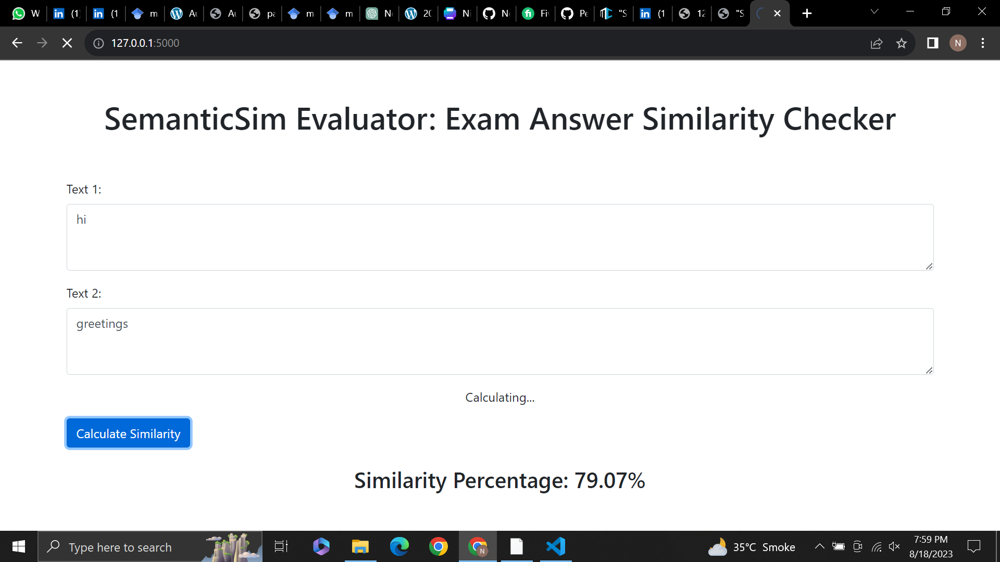
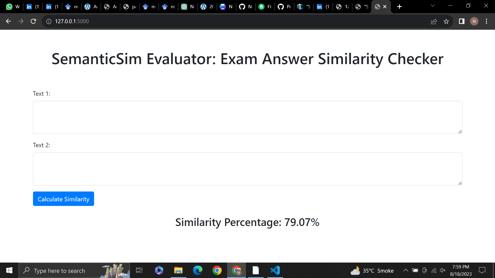

# SemanticSim Evaluator

### Welcome to my project. It is a Flask-based web tool utilizing pre-trained BERT model to measure semantic similarity between two text inputs and displaying the calculated percentage on an interactive webpage.


## Instructions to run the project
-To install dependencies, run the commands:

```pip install -r requirements.txt```

-To run the project

```python app.py```


## Output

Here are some example images of the output from my project:






